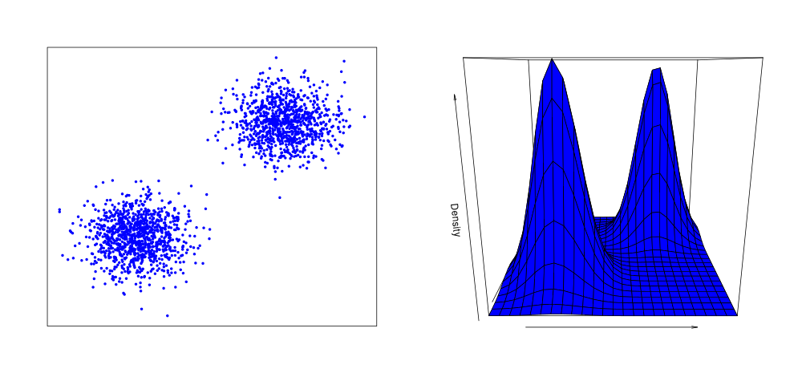

## Outline of the algorithm
The outline of the clustering procedure follows the algorithm set out in Rodriguez \& Laio (2014). The basic assumption is that clusters of data points in *n*-dimensional space can be thought of as approximating some arbitrary density distribution. Clusters are defined as areas of high density, and cluster centres are defined as regions of local density maxima, which are sufficiently separate from other maxima.


<center>

```{r, out.width = "75%", echo=FALSE, fig.cap = "Points in *n*-dimensional space can be thought of as approximating some arbitrary density distribution. (left) Points drawn from one of two 2d Gaussian distributions, each of which represents a cluster. (right) The density can be estimated from the data; increases in the density represent clusters and the peaks represent cluster centres"}

```
</center>


The clustering procedure aims to find the centre of each cluster i.e. the point of highest density within a cluster. These cluster centres can be thought of as peaks in the density landscape. The number of cluster centres defines the number of clusters. Therefore, unlike many clustering methods, this algorithm has the advantage that the number of clusters are not defined prior to clustering. The way this is achieved is as follows. For each data point, two quantities are calculated:

1. its local density ($\rho_{i}$)
2. its Euclidean distance from the nearest point of higher density ($\delta_i$).

In a slight variation from Rodriguez and Laio (2014), the local density is approximated by calculating the Euclidean distance between point *i* and its $k^{th}$ nearest neighbour ($dKNN$):

\begin{equation}\label{eq:rho}
    \rho_{i}\propto{\frac{1}{[dKNN]^n}}
\end{equation}

where $n$ is equal to the dimensionality of the data. This method of estimating the density can therefore be thought of as asking what is the minimum volume necessary to encapsulate the \textit{k} nearest neighbours of data point \textit{i}.

\noindent{}$\delta_{i}$ is calculated as the minimum distance to any point of higher density, $j$:

\begin{equation}\label{eq:delta}
    \delta_{i} = \min_{j:\rho_{j} > \rho_{i}} (d_{ij})
\end{equation}

The point with highest density is given $\rho_{i} = \max_{j}(d_{ij})$, that is the maximum distance between the highest density point and any other point. Intuitively, it is expected that points of low density tend to be far away from points of higher density simply because there are fewer points close by. Conversely, high density points tend to be close to points of higher density. Therefore, a negative correlation is expected when plotting $\delta$ vs $\rho$. This correlation breaks down, however, when in a local maximum of the density since  it is necessary to travel further than expected to find a point of higher density, at which point we get $\delta_{i}$ much larger than expected, given $\rho_{i}$. These outliers become the cluster centres and define the number of clusters. The remaining points are then assigned to a cluster which is the same as their nearest neighbour of higher density. Using this method, cluster centres are therefore defined as local maxima of the density, sufficiently separated from points with higher densities.

## Implementation

We can run the algorithm on some surrogate data to see how it works.

First we load the data and plot it.

```{r}
source("scripts/DBC_functions.R")
source("scripts/colourscale.R")
dat <- read.table("data/data.dat")
plot(dat, ann = F, xaxt = "n", yaxt = "n", pch = 19, cex = 0.4)
```

We can see that the data appears to come from 3 clusters. Our aim is to associate each data point to one of the 3 clusters.

First we calculate the Euclidean distance between all points

```{r}
euc_dist <- as.matrix(dist(dat, upper = T))
```


Next we can calculate the local density of the data. Here we need to choose our parameter, $k$, which defines which nearest neighbour is used to calculate the density for each point. Larger values of $k$ result in a smoother estimate of the density, whilst a smaller $k$ will pick up small changes in the local density. For now we choose $k = 200$.

```{r}
dens <- calculate_density(euc_dist, KNN = 200)
head(dens, n = 20)
```
If we colour code each point according its estimated density and plot the data again, we can see that we seem to get a good approximation of the density, where more dense points are purple and sparser points are green.

```{r}
cols <- colPalette(dens)
plot(dat, ann = F, xaxt = "n", yaxt = "n", pch = 19, cex = 0.4, col = cols)
```

Next we can estimate the minimum distance to any point of higher density.

```{r}
dis <- calculate_NNHD(euc_dist, dens)
str(dis)
```
The output of this function is a list of length 2. The first element is a vector of the Euclidean distance to each points nearest neighbour of higher density, and the second element contains a label of which data point is the nearest neighbour of higher density.


